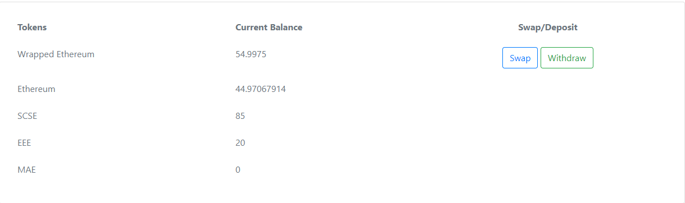
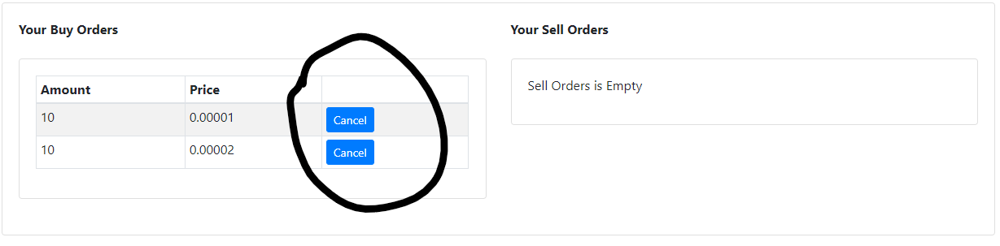

# 1. Deployment

## 1.1 Local Deployment

### Requirements

- Truffle v5.1.47 (core: 5.1.47)
- Solidity v0.5.16 (solc-js)
- Node v12.16.3
- Web3.js v1.2.1
- npm

### Initial Setup

1. cd into project directory
2. Run `npm install`
3. Create a `.secret` file and add your Metamask's seed phrase in the file

### Set Up Ganache

1. Create a new project on Ganache
2. Add **truffle-config.js** from project folder
3. Start Ganache Server
4. cd into project directory
5. Run `truffle migrate --reset --network development` in console

### Set Up Accounts

 

1. Open up Metamask and add a new Custom RPC

2. The RPC URL can be found on Ganache

3. Import the first account on Ganache to your Metamask. The private key of that account can be found by clicking on the 'key' icon on Ganache
4. You can add all the accounts in Ganache to simulate multiple users.
5. Only the first account is the owner account which deployed all the contracts. This will be the account that will have the initial supply of SCSE, MAE and EEE tokens.
6. If you do not see the ETH being reflected in your Metamask wallet, change to another network and change back to Ganache

### Set Up Website

1. cd into '**.Something Funky Is Nice/dex-exchange**'
2. Run `npm install`
3. Run `npm run start` in console
4. If all token balances are 0 in the website, make sure to ensure your Metamask account is connected to the website

# 2. Plan

For this assignment, we will have an **Owner** who will be deploying all of our contracts. This **Owner** will be allocated the initial supply of tokens for SCSE, MAE and EEE. Thus, 1 million of each tokens will be allocated to the **Owner**.

The **Owner** will sell these tokens on the exchange at an affordable price.

**Users** who wish to obtain these tokens will have to trade their ETH for these tokens. Before doing so, they have to first convert their ETH to the base token, WETH. Only by doing so, can they trade on the exchange using the trading pairs available.

# 3. Funky Crypto Exchange Architecture

In our **Exchange**, we have a structure holding onto these coins, **SCSE**, **EEE** and **MAE**. In each of these coins, it holds a **Buy** and **Sell** book.

## 3.1 Token's Order Book (Buy / Sell)

In the Token's Order Book, it is used to store the **Limit Orders** that users had made in the exchange. A limit order has a price and amount. In order to easily insert new **Limit Orders**, we shall do the following:

1. In each Order Book, it stores multiple **Price** which are linked together using a linked list. This **Price** are inserted in ascending order.
2. We used a linked list as this allows for easier insertion of new prices as well as to remove the **Price** when it's orders has been fully filled.
3. In each **Price**, there may be one or more **Amount**.
4. We also used a linked list to connect these **Amount** but it is not used to insert the **Amount** in an order. The linked list is to allow for easier deletion of **Amount** when an order has been fully filled or when an order is deleted by the user.
5. The nodes in **Amount** are inserted based on a Queue system. The oldest orders have a higher priority than the newer orders. New orders are place behind older orders.

## 3.2 Buy Limit Order

## 3.3 Sell Limit Order

## 3.4 Buy Market Order

For a **Buy Market Order**, it is similar to the **Buy Limit Order**, with the only difference being there is no price indication. The order will take whatever is inside the **Sell Order Book** and trade the amount that the user wants _from the cheapest price order to the most expensive price order_. This continues until the amount is fully filled, the user ran out of WETH to trade or there is no more orders in the **Sell Order Book**.

## 3.4 Sell Market Order

For a **Sell Market Order**, it is the opposite of a **Buy Market Order**. It searches the **Buy Order Book** _from the most expensive orders to the least expensive orders_.

# 4. Features

## 4.1 Metamask Integration

In order to use the functionality of the website, users **MUST** install Metamask.

## 4.2 ETH/WETH Token Swap

In order to facilitate a smooth trading experience, we will use Wrapped Ethereum as our base token to trade. Users are able to swap their ETH to WETH in our exchange and vice versa.

## 4.3 Trading Pairs

Funky Crypto Exchange supports the following trading pair:

1. WETH/SCSE
2. WETH/MAE
3. WETH/EEE

## 4.4 View Balance

Users are able to view their balances that they currently have in their Metamask account on our exchange.

## 4.5 Transaction Types

Funky Crypto Exchange supports the following transactions:

1. Limit Order (Buy/Sell)
2. Market Order (Buy/Sell)

## 4.6 View Global Order Book

Users are able to view both Buy and Sell order books for each trading pair.

## 4.7 View Users Order Book

Users are able to view their own orders that they have made on each trading pair.

## 4.8 Cancellation of Orders

Users are able to cancel the orders they have previously made.
